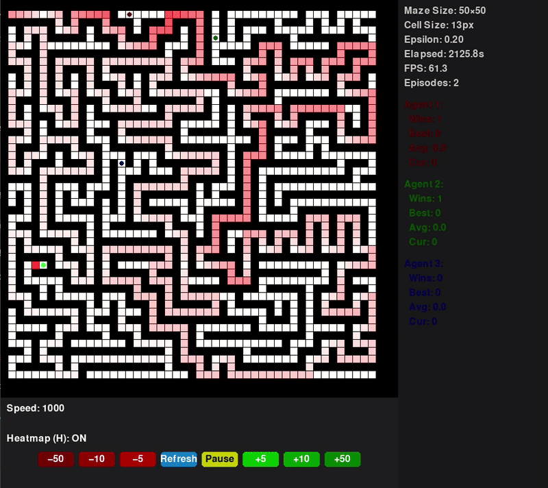

# Maze AI — Heatmap & Agents

A real‑time Q‑learning maze solver built with Python and Pygame. Generate perfect mazes of any size, train multiple agents to find optimal paths, and visualize their learning with an interactive GUI.

---

## 🚀 Features

- **Perfect Maze Generation**: Recursive backtracking carve algorithm with automatic goal at the farthest reachable cell.
- **Q‑Learning Agents**: Three agents independently learn via ε‑greedy Q‑learning, with penalties for wall‑hits and reversals.
- **Dynamic GUI Scaling**: Fixed 660×660px grid area that automatically resizes cells (and agents) to fit any `ROWS × COLS` configuration.
- **Heatmap Overlay**: Live Q‑value visualization—every learned positive Q‑value is highlighted in red.
- **Interactive Controls**:
  - Speed adjustment buttons: ±5, ±10, ±50 steps per frame.
  - Pause/Play and Refresh maze.
  - Toggle heatmap with the **H** key.
- **Stats Side‑Panel**: Displays maze size, cell size, ε, elapsed time, FPS, total episodes, and per‑agent stats (wins, best/avg/current steps), each in the agent’s color.

---
## 🎬 Demo



Agents learning to solve a maze in real time, with heatmap overlay and dynamic stats.

---

## 📦 Requirements

- Python 3.7+
- Pygame 1.9.6+ (install via `pip install pygame`)

---

## ⚙️ Installation & Setup

1. **Clone the repository**
   ```bash
   git clone https://github.com/yourusername/maze-ai-heatmap-agents.git
   cd maze-ai-heatmap-agents
   ```

2. **Install dependencies**
   ```bash
   pip install pygame
   ```

3. **Configure maze size** (optional)
   - Open `maze.py` and adjust:
     ```python
     ROWS, COLS = 50, 50  # any positive integers
     ```
   - Leave `CELL_SIZE = 60`—the GUI will recalculate actual drawing size.

4. **Run the simulation**
   ```bash
   python main.py
   ```

---

## 📁 File Structure

```
repo-root/
├─ main.py        # GUI loop, controls, heatmap & stats panel
├─ maze.py        # Maze generation & drawing routines
├─ agent.py       # Q‑learning agent logic and drawing
├─ README.md      # This documentation
└─ requirements.txt #Requirments for running this program
```

---

## 🎮 Controls & Interaction

- **Buttons** (bottom UI):
  - `−50/−10/−5`: decrease simulation speed
  - `+5/+10/+50`: increase simulation speed
  - **Pause/Play**: stop/start agent updates
  - **Refresh**: generate a new maze & reset agents
- **Keyboard**:
  - **H**: toggle heatmap overlay

---

## 🔧 How It Works

1. **Maze Generation**: `maze.py` uses recursive backtracking to carve a perfect maze inside a grid, then identifies the farthest cell for the goal.
2. **Agent Learning**: Each `Agent` in `agent.py` maintains a Q‑table. On each step, it chooses an action via ε‑greedy, moves (with smooth interpolation), and updates Q‑values based on reward (distance reduction or goal).
3. **Visualization**:
   - **draw_maze** & **draw_goal** accept dynamic `cell_size` and offsets.
   - **draw_heatmap** prunes dead‑end branches and colors all positive Q‑value cells.
   - **draw_side_panel** renders real‑time stats in agents’ colors.

---

## 📄 License

This project is open‑source under the MIT License. See `LICENSE` for details.

